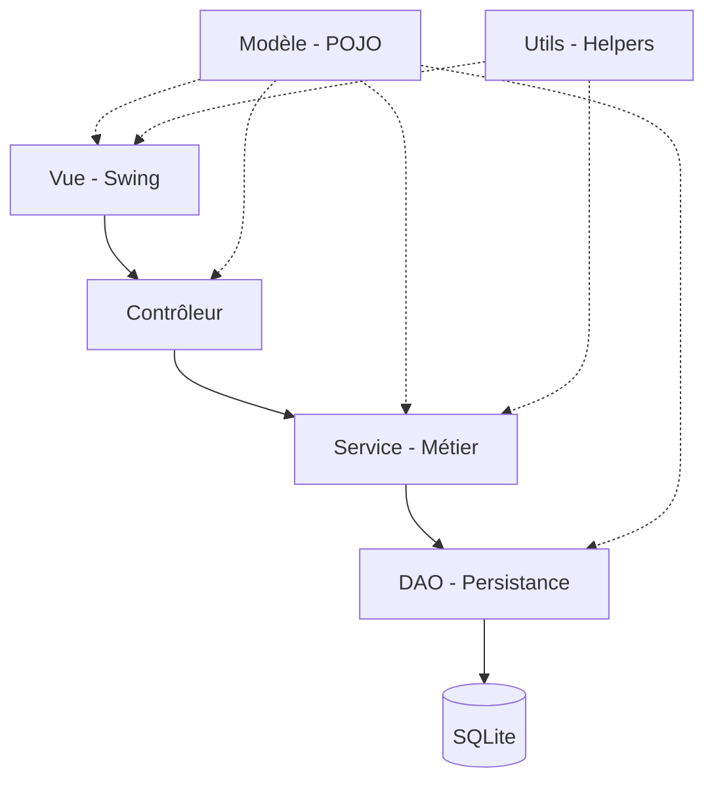

# 🏗️ Documentation Technique — Gestion Restaurant

## Architecture



| Couche | Package | Rôle |
|---|---|---|
| Vue | `com.restaurant.view` | Interfaces Swing, affichage uniquement |
| Contrôleur | `com.restaurant.controller` | Orchestration Vue ↔ Service |
| Service | `com.restaurant.service` | Logique métier, transactions |
| DAO | `com.restaurant.dao` | Accès SQLite (CRUD) |
| Modèle | `com.restaurant.model` | Entités POJO, Enums |
| Utilitaires | `com.restaurant.utils` | Design System, ResourceUtils, PasswordUtils |

---

## Modèle Relationnel (SQLite)

```sql
CATEGORIE      (id_cat, libelle_cat)
PRODUIT        (id_pro, nom_pro, id_cat→CATEGORIE, prix_vente, stock_actu, seuil_alerte)
UTILISATEUR    (id_uti, nom_util, mdp, role)
COMMANDE       (id_cmde, date, etat, total)
LIGNE_COMMANDE (id_lig, id_cmde→COMMANDE, id_pro→PRODUIT, qte_lig, prix_unit)
MVT_STOCK      (id_mvt, id_pro→PRODUIT, type, quantite, date, motif)
```

> [!NOTE]
> La base de données est un fichier unique : `data/gestion_restaurant.db`. `ResourceUtils.getDataPath()` la localise automatiquement en mode dev et en mode packagé (jpackage).

---

## Transactions SQL

`CommandeService.validerCommande()` utilise `setAutoCommit(false)` / `commit()` / `rollback()` pour garantir l'atomicité de la déduction du stock, de l'enregistrement du mouvement et du changement d'état de la commande.

---

## Sécurité

- Mots de passe hashés en **SHA-256** via `PasswordUtils`.
- Rôles vérifiés à la connexion.
- **Auto-suppression bloquée** : un admin ne peut pas supprimer son propre compte (`AdminController` vérifie `idAdminConnecte`).
- **Changement de mot de passe** : l'admin peut modifier son propre MDP depuis le panneau Utilisateurs (bouton 🔑, vérifie l'ancien mot de passe avant).
- Déconnexion automatique après 10 min d'inactivité.

---

## Gestion des exceptions

- DAO déclarent `throws SQLException`.
- Contrôleurs capturent `SQLException` séparément des autres exceptions.
- Les erreurs de contrainte (suppression de produit lié) sont gérées via les codes d'erreur SQLite.

---

## Sauvegarde & Restauration

- **Export** : Copie physique du fichier `data/gestion_restaurant.db` vers l'emplacement choisi.
- **Import** : Remplace le fichier actuel par une sauvegarde (après vérification d'existence).

---

## CI/CD — Releases automatiques

Chaque tag Git (ex: `v1.0.0`) déclenche le workflow `.github/workflows/release.yml` qui génère :

| Runner | Package |
|---|---|
| `ubuntu-latest` | `.deb` (Debian/Ubuntu) et `.rpm` (Fedora/RHEL) |
| `windows-latest` | `.exe` (Windows, WiX requis) |

Les 3 fichiers sont publiés automatiquement dans les **GitHub Releases**.

---

## Logging

Log4j2 configuré via `src/log4j2.xml`. Logs écrits dans `logs/app.log`.

---

## Dépendances externes (`/lib`)

| JAR | Usage |
|---|---|
| `sqlite-jdbc-*.jar` | Pilote SQLite |
| `jfreechart-1.5.3.jar` | Graphiques dashboard |
| `itextpdf-5.5.13.3.jar` | Export PDF |
| `poi-*.jar` | Export Excel/CSV |
| `log4j-api-*.jar` + `log4j-core-*.jar` | Logging |
